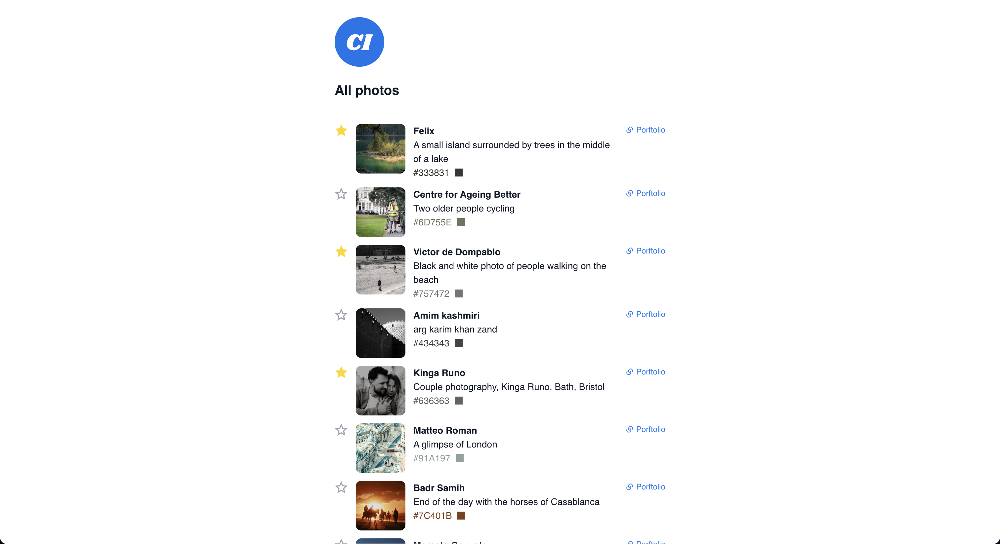

<h1 align="center">
	📷 Photo Gallery 🖼️
</h1>

	<i>A fullstack project with React + Typescript and Flask.</i>

	
	
	
	
	

<h3 align="center">
	<a href="#%EF%B8%8F-about">About</a>
	 · 
	<a href="#%EF%B8%8F-usage">Usage</a>
</h3>

---

## 🗣️ About

A minimal website app for displaying a photo gallery. Stack:

- **Front-end:** Typescript, React, Vite.
- **Back-end:** Python, Flask, Postgres, SQLAlchemy, JWT, Docker.

## 🛠️ Usage

Refer to the README files inside the `client` and `server` folders.
